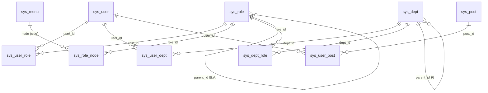

# 数据模型

> 本文讲清 CCCMS 的 25 张表：分几组、每组解决什么问题、关键字段与枚举取值、索引意图，以及软删除 / 回收站带来的约束。适合后端与需要理解数据归属的前端同学。

---

## 一、总览

表结构唯一来源是 [`db/schema.sql`](../../server/plugin/cccms/db/schema.sql)（MySQL 8 / InnoDB / utf8mb4），
初始化数据在 [`db/seed.sql`](../../server/plugin/cccms/db/seed.sql)。本文只做**语义解释**，不改写 DDL；
两者冲突时以 `schema.sql` 为准。

| # | 表 | 分组 | 模型 | 软删除 | 说明 |
|---|----|------|------|--------|------|
| 1 | `sys_user` | RBAC / 组织 | `User` | ✅ | 账号、密码(bcrypt)、状态、最后登录 |
| 2 | `sys_role` | RBAC / 组织 | `Role` | ✅ | 角色 + 继承(`parent_id`) + 数据档位(`data_scope`) |
| 3 | `sys_user_role` | 关联表 | `UserRole` | — | 用户-角色（多对多） |
| 4 | `sys_menu` | RBAC / 组织 | `Menu` | ✅ | 目录 / 菜单 / 按钮**同一棵树**，`node` 即权限节点 slug |
| 5 | `sys_role_node` | 关联表 | `RoleNode` | — | 角色-权限节点授权 |
| 6 | `sys_dept` | RBAC / 组织 | `Dept` | ✅ | 部门（无限级） |
| 7 | `sys_user_dept` | 关联表 | `UserDept` | — | 用户-部门（多对多） |
| 8 | `sys_dept_role` | 关联表 | `DeptRole` | — | 部门-角色（**按部门批量给角色**） |
| 9 | `sys_post` | RBAC / 组织 | `Post` | ✅ | 岗位 |
| 10 | `sys_user_post` | 关联表 | `UserPost` | — | 用户-岗位（多对多） |
| 11 | `sys_data_rule` | 数据权限 | `DataRule` | ✅ | 行级 + 字段级规则 |
| 12 | `sys_data_scope_table` | 数据权限 | `DataScopeTable` | — | 受控表白名单（决定规则页能选哪些表） |
| 13 | `sys_category` | 字典与分类 | `Category` | ✅ | 通用分类，按 `module` 复用（`dict` / `file`） |
| 14 | `sys_dict_type` | 字典与分类 | `DictType` | ✅ | 字典类型 |
| 15 | `sys_dict_data` | 字典与分类 | `DictData` | ✅ | 字典数据项 |
| 16 | `sys_config` | 系统配置 | `Config` | — | 键值配置 + 表单元信息 |
| 17 | `sys_log` | 日志 | `OperationLog` | — | 操作日志 + 登录日志**同表** |
| 18 | `sys_file` | 附件 | `File` | ✅ | 附件元信息（文件本体在存储驱动里） |
| 19 | `sys_crontab` | 定时任务 | `Crontab` | ✅ | 任务定义 + 运行态字段 |
| 20 | `sys_crontab_log` | 定时任务 | `CrontabLog` | — | 每次执行的结果 |
| 21 | `sys_crontab_retry` | 定时任务 | — | — | 独立重试队列 |
| 22 | `sys_notice` | 通知公告 | `Notice` | ✅ | 公告主体 + 投放范围标识 |
| 23 | `sys_notice_target` | 通知公告 | `NoticeTarget` | — | 定向投放明细（部门 / 角色 / 用户） |
| 24 | `sys_notice_read` | 通知公告 | `NoticeRead` | — | 已读记录（驱动未读角标） |
| 25 | `sys_tenant` | 多租户 | `Tenant` | ✅ | 租户（**只存真实租户 `id >= 1`**；平台租户 `0` 是虚拟的，不落库） |

> 表名前缀由 `plugin/cccms/config/database.php` 的 `prefix`（默认 `sys_`）提供，
> 代码里写 `Db::name('user')` 即可，**不要手写 `sys_` 前缀**。

---

## 二、全局约定

这几条贯穿所有表，先看这里再看单表能省很多来回。

### 2.1 时间戳

- `create_time` / `update_time` 由**数据库默认值**写入
  （`DEFAULT CURRENT_TIMESTAMP` / `ON UPDATE CURRENT_TIMESTAMP`），业务代码不显式赋值。
- 因此用查询构造器直接写 SQL 也不会漏填，但**批量 `INSERT` 时要注意别显式塞 `NULL`**。
- 日志表（`sys_log` / `sys_crontab_log`）只有 `create_time` / `run_time`，没有 `update_time`：日志只追加。

### 2.2 软删除

- 业务主数据带 `delete_time`（`NULL` = 未删除），判定与查询收口在 [`support/SoftDelete.php`](../../server/plugin/cccms/support/SoftDelete.php)。
- **关联表 / 日志 / 配置不做软删除**（见表 1 的「软删除」列）。
- ⚠️ **唯一键陷阱**：`sys_user.username`、`sys_role.code`、`sys_post.code`、`sys_dict_type.type`、
  `sys_menu.node` 是唯一索引，**软删除后该值仍被占用**。要复用同一个取值，
  必须先在回收站里「彻底删除」。见 [07-功能模块 §十六](07-功能模块.md#十六回收站recycle)。
- ⚠️ **唯一键不含 `tenant_id`**：多租户下这些取值仍是**全局唯一**（如 `username` 全站唯一），
  新表若参与隔离也不要往唯一索引里加租户列 —— 详见 §十一。

### 2.3 结构约定

- **没有物理外键**（`SET FOREIGN_KEY_CHECKS = 0`）：一致性由 Logic / Model 层保证，
  避免级联删除带来不可预期的连锁反应。
- 关联表统一 `id` 自增主键 + `uk_xx_yy(a_id, b_id)` 联合唯一键，重复绑定在数据库层就被拒绝。
- JSON 列（`sys_data_rule.dept_ids`、`sys_config.options`、`sys_crontab.params`）用 MySQL 原生 `json` 类型，
  **不要在 SQL 里手拼字符串**。
- 布尔语义统一用 `tinyint`（`1` / `0`），不出现 `true` / `false` 字面量。

---

## 三、RBAC 与组织

### 3.1 关系图

### 3.2 `sys_user`

| 字段 | 类型 | 说明 |
|------|------|------|
| `username` | varchar(64) | 登录账号，**唯一** |
| `password` | varchar(255) | bcrypt 散列，绝不存明文 |
| `nickname` / `avatar` / `email` / `phone` | varchar | 资料字段，参与密码策略的「身份包含」判断 |
| `status` | tinyint | `1` 启用 / `0` 禁用；禁用后登录被拒 |
| `login_time` / `login_ip` | datetime / varchar(64) | 最后成功登录的时间与 IP |

- 索引：`uk_username`。
- 登录时用 `User::withoutGlobalScope()` 查账号（**回收站账号不可登录**）。

### 3.3 `sys_role`

| 字段 | 说明 |
|------|------|
| `code` | 角色标识，唯一 |
| `parent_id` | 父角色，`0` = 顶级；用于**权限节点继承** |
| `data_scope` | 数据档位，默认 **`4`（仅本人）** |
| `sort` / `status` | 排序 / 状态 |

`data_scope` 五档取值：

| 值 | 含义 |
|----|------|
| `1` | 全部数据 |
| `2` | 本部门及以下 |
| `3` | 本部门 |
| `4` | 仅本人（**默认**） |
| `5` | 自定义（走 `sys_data_rule`） |

> ⚠️ **两个关键口径**（详见 [06-数据权限](06-数据权限.md)）：
> ① **档位不继承父角色**，只在直连角色间取最宽松（`min`）；
> ② 默认值是 `4` 而不是 `1`，因为漏配时必须是**最窄**兜底（fail-closed）。
> 祖先角色的档位不参与计算，祖先链仅用于「权限节点继承」与规则绑定角色。

### 3.4 `sys_menu`（菜单 + 权限节点同树）

| 字段 | 说明 |
|------|------|
| `type` | `1` 目录 / `2` 菜单 / `3` 按钮 |
| `path` / `component` / `icon` | 前端路由与组件，按钮为空 |
| `node` | **权限节点 slug**（如 `cccms:user:save`），唯一；按钮必填 |
| `status` | `1` 显示 / `0` 隐藏 |
| `keep_alive` | 是否被 `keep-alive` 缓存 |

- 目录 / 菜单由 [`db/menu.php`](../../server/plugin/cccms/db/menu.php) 声明后 `cccms:menu-sync` 同步；
  **按钮节点由控制器注解经 `cccms:perm-scan` 生成**。
- `sys_role_node.node` 存的是 **slug 字符串**而不是 `menu.id` —— 菜单被删后授权仍在，
  菜单恢复时授权自动重新生效（鉴权侧会自动排除回收站菜单）。

### 3.5 组织：`sys_dept` / `sys_post` 与三张关联表

- `sys_dept` 是无限级树（`parent_id`），字段含 `leader` / `phone` / `email` / `sort` / `status`。
- `sys_post` 是平铺的岗位表（`code` 唯一）。
- `sys_dept_role` 是「**按部门批量授予角色**」：用户的有效角色 = 直连角色 ∪ 所属部门的角色 ∪ 祖先角色链。

---

## 四、数据权限

### 4.1 `sys_data_rule`

一条规则 = 「绑定谁 + 对哪张表 + 哪个字段 + 什么动作 + 什么取值」。

| 字段 | 说明 |
|------|------|
| `user_id` / `post_id` / `role_id` | 绑定维度，`0` = 不限 |
| `dept_ids` | JSON 数组，绑定多个部门（跨部门） |
| `bind_mode` | `or` = 任一命中 / `and` = 已填写的全部命中 |
| `table_name` | 目标表（**不含前缀**），空 = 不限表 |
| `field` | 目标字段 |
| `action` | `row` / `hidden` / `readonly` / `mask` / `encrypt` |
| `operator` | 行级操作符：`=` `!=` `in` `like` `>` `>=` `<` `<=` `between` |
| `value` / `value_type` | 取值与取值类型（`static` 静态 / `dynamic` 动态变量，如 `{dept.subtree}`） |

- `action` 的五个取值分两类：`row` 影响**哪些行可见**；其余四个影响**字段怎么呈现**
  （隐藏 / 只读 / 脱敏 / 加密）。
- 取值可以是动态变量（`{user.id}` / `{dept.subtree}` / `{role.ids}`），在请求期由 `DataScope` 解析。
- 索引：`idx_user` / `idx_post` / `idx_role`。

### 4.2 `sys_data_scope_table`

受控表白名单，决定「自定义规则」页面里**能选到哪些表**。

- 唯一键 `uk_table`。
- ⚠️ **登记的是「可配规则」而不是「有没有数据权限」**：
  未登记的表依然可能有预设基线（仅本人 / 本部门），基线由模型声明决定，与登记无关。
- 登记前提是该表**已接入数据权限**（模型声明参与 + 查询走模型），否则规则配了也不生效。
- 体检工具：`php webman cccms:data-scope-check`（接入检查）、`cccms:data-rule-check`（规则冲突体检）。

---

## 五、字典与分类

设计要点：**分类是通用能力，字典是它的一个使用者**。

| 表 | 字段要点 |
|----|----------|
| `sys_category` | `module`（`dict` / `file`）区分归属；`parent_id` 支持层级；索引 `idx_module(module, parent_id)` |
| `sys_dict_type` | `type` 唯一（字典类型标识）；`category_id` 指向分类，`0` = 未分类 |
| `sys_dict_data` | `type_id` 指向字典类型；`label` 显示名、`value` 实际值 |

- 两级结构：**字典类型 → 字典数据**，两者都可软删除。
- 分类不作为字典专属，附件分类（`module = file`）复用同一张表。

---

## 六、系统配置 `sys_config`

| 字段 | 说明 |
|------|------|
| `name` | 配置键（如 `security.password_strength`），唯一 |
| `title` / `type` / `options` | 后台表单的渲染元信息：`input` / `switch` / `select` / `input-number` / `textarea` / `radio` |
| `value` | 配置值（`text`，统一按字符串存） |
| `group` / `sort` | 分组与组内排序 |
| `status` | `1` 生效 / `0` 停用 |

- 读取统一走 [`support/SysConfig.php`](../../server/plugin/cccms/support/SysConfig.php)（带 `cccms:config:all` 缓存，保存后立即失效）。
- 种子内置 **5 组 32 项**，清单见 [11-常用命令与运维 §五](11-常用命令与运维.md#五系统配置项清单)。
- 新增配置项 = `db/seed.sql` 加一行 + 消费处 `SysConfig::getXxx('your.key', 默认值)`。

---

## 七、日志 `sys_log`

**操作日志与登录日志共用一张表**，用 `path` 区分：登录记录固定 `path = '/auth/login'`，
且操作日志中间件**不记该路径**（二者天然互斥）。

| 字段 | 说明 |
|------|------|
| `user_id` / `username` | 操作者 |
| `method` / `path` | 请求方法与路径 |
| `node` / `title` | 权限节点 slug / 语义化操作名（取自权限注解） |
| `status` / `status_code` / `message` | 结果：`1` 成功 / `0` 失败；失败原因写在 `message`（如登录失败原因） |
| `trace_id` | 请求链路 ID，把一次请求的多条记录串起来 |
| `ip` / `ua` | 来源信息 |
| `params` / `result` | 请求参数（**已脱敏**）与执行结果 |
| `cost` | 耗时（ms），超过 `log.slow_threshold` 时额外写 `slow.log` |

- 索引：`idx_user` / `idx_create_time` / `idx_node` / `idx_trace_id`。
- 只有 `create_time`，无 `update_time`。归档：`php webman cccms:log-archive`。

> **已废弃**：`sys_login_log` 表与 `LoginLog` 模型已被 `cccms:db-upgrade` **DROP**，
> 登录记录统一并入本表（见 [更新日志](更新日志.md) 2.1.0「移除」）。

---

## 八、附件 `sys_file`

存的是**元信息**，文件本体在存储驱动（本地 / OSS / COS / 七牛）里。

| 字段 | 说明 |
|------|------|
| `name` / `original_name` | 存储文件名 / 用户原始文件名 |
| `path` / `url` | 存储路径与访问 URL（URL 由 `upload.url_prefix` 生成） |
| `category_id` | 分类（指向 `sys_category`，`module = file`） |
| `ext` / `mime` / `size` | 扩展名 / MIME / 字节数 |
| `driver` | 存储驱动 |
| `hash` | sha1，用于去重与完整性校验（索引 `idx_hash`） |
| `create_by` | 上传人，**数据权限基线落在这一列** |

---

## 九、定时任务

### 9.1 `sys_crontab`（定义 + 运行态）

| 字段组 | 字段 | 说明 |
|--------|------|------|
| 定义 | `name` / `group_name` / `expression` | 任务名 / 分组（仅归类筛选）/ **六段** cron（秒 分 时 日 月 周） |
| 目标 | `target` / `params` | 实现 `CrontabTask` 的类名（**执行白名单，杜绝 RCE**）+ 参数 JSON |
| 策略 | `overlap` / `timeout` / `retry_times` / `retry_interval` | 重叠策略 `skip` / `allow`；超时秒数；重试次数与间隔 |
| 运行态 | `running` / `running_at` / `last_run_time` / `next_run_time` | 运行锁与调度时间轴 |
| 历史兼容 | `retry_left` / `retry_at` | ⚠️ **不再写入**，重试已迁到 `sys_crontab_retry` |

### 9.2 `sys_crontab_log`

| 字段 | 说明 |
|------|------|
| `crontab_id` / `name` | 归属任务 |
| `status` | `1` 成功 / `0` 失败 / `2` 跳过（上次未结束）/ `3` 超时释放 |
| `source` | 触发来源 `cron` / `retry` / `manual` |
| `output` / `cost` / `run_time` | 输出或异常 / 耗时(ms) / 执行时间 |

### 9.3 `sys_crontab_retry`（独立重试队列）

设计说明：重试**与 cron 调度严格解耦**。失败后把「重试」当独立任务投递到这里，由调度进程单独消费，
只按自己的 `retry_at` 触发 —— 避免「重试吃掉一次正常调度」。
（旧实现把 `retry_left` / `retry_at` 写在 `sys_crontab` 上，重试与 cron 同秒命中会让 cron 被跳过。）

| 字段 | 说明 |
|------|------|
| `crontab_id` | 任务 ID |
| `attempt` | 第几次重试（`1..retry_times`） |
| `retry_at` | 计划重试时间（索引 `idx_due`） |

---

## 十、通知公告

### 10.1 `sys_notice`

| 字段 | 说明 |
|------|------|
| `title` / `content` | 标题 / 正文 |
| `type` | `1` 通知 / `2` 公告 |
| `level` | `1` 普通 / `2` 重要 |
| `status` | `1` 已发布 / `0` 草稿 |
| `scope` | 投放范围：`0` 全部 / `1` 指定部门 / `2` 指定角色 / `3` 指定用户 |
| `publish_at` | 发布时间；**已发布但未填 → 视为立即发布** |
| `expire_at` | 过期时间，`NULL` = 不过期；过期后不在「我的消息」展示 |
| `read_count` | 已读人数**冗余计数**，只在首次已读时 +1 |
| `create_by` | 创建人 |

### 10.2 `sys_notice_target` / `sys_notice_read`

| 表 | 关键字段 | 约束 |
|----|----------|------|
| `sys_notice_target` | `notice_id` / `target_type`(`dept`/`role`/`user`) / `target_id` | 唯一键 `uk_notice_type_target`，索引 `idx_type_target` |
| `sys_notice_read` | `notice_id` / `user_id` / `read_time` | 唯一键 `uk_notice_user`（已读幂等），索引 `idx_user` |

- `scope = 0` 时**不写** `sys_notice_target`；阅读侧的过滤口径由 `NoticeLogic::targetedNoticeIds()` 统一。
- 模型声明**不参与数据权限**：公告是广播内容，没有「归属人」语义。
- 软删公告时会同时清理已读记录（`RecycleLogic` 已登记 `notice` 类型）。

---

## 十一、多租户

> 隔离机制与数据权限的关系见 [06-数据权限](06-数据权限.md)，此处只讲**表结构**。

### 11.1 `sys_tenant`

| 字段 | 类型 | 说明 |
|------|------|------|
| `id` | `bigint unsigned` | 主键；**`id >= 1` 才是真实租户**，平台租户 `0` 是虚拟的，**不落行** |
| `name` | `varchar(64)` | 租户名称 |
| `code` | `varchar(64)` | 租户标识，唯一键 `uk_code`（**全局唯一**） |
| `contact` / `phone` | `varchar` | 联系人与电话 |
| `status` | `tinyint` | `1` 启用 / `0` 禁用（封禁租户用状态而非删除） |
| `expire_at` | `datetime` | 到期时间，`NULL` = 不过期 |
| `remark` | `varchar(255)` | 备注 |
| `create_time` / `update_time` / `delete_time` | `datetime` | 时间戳 + 软删除 |

- 模型 `Tenant` 声明**不参与数据权限**（`$dataScope = false`），且**不开启**租户作用域 ——
  否则超管切进某租户后反而看不到别的租户，无法切回。
- 平台租户行（`id = 0`）由 `TenantLogic` 在列表 / 下拉里**虚拟补出**，不参与写入与删除。

### 11.2 隔离范围

| 项 | 说明 |
|----|------|
| **隔离表（12 张）** | `sys_user` / `sys_dept` / `sys_role` / `sys_post` / `sys_data_rule` / `sys_data_scope_table` / `sys_notice` / `sys_file` / `sys_category` / `sys_dict_type` / `sys_dict_data` / `sys_crontab`；各含 `tenant_id bigint unsigned NOT NULL DEFAULT 0`（`0` = 平台）与索引 `idx_tenant` |
| **平台级表** | `sys_menu` / `sys_config` / `sys_log` / `sys_crontab_log` / `sys_tenant`，以及**全部关联表**（`sys_user_role` / `sys_user_dept` / `sys_user_post` / `sys_dept_role` / `sys_role_node` / `sys_notice_target` / `sys_notice_read`） |
| **写入** | 由 [`ScopedQuery`](../../server/plugin/cccms/app/model/ScopedQuery.php) 统一经 `TenantContext::stamp()` 补齐 `tenant_id`，业务代码**不显式赋值** |
| **读取** | 模型上显式声明 `$tenantScope = true` 才叠加租户条件（**opt-in**：代码生成器产出的 `ks_*` 插件表没有该列）；顺序为 `$globalScope = ['tenant', 'dataScope']` |
| **跨租户** | `Model::withoutGlobalScope()` **仍保留**租户条件；只有 `withoutAllScopes()` 能跨租户（登录链路 / CLI / 迁移 / 全局唯一性查重，且需 `withTrashed()` 才含回收站） |

---

## 十二、软删除与回收站

| 项 | 说明 |
|----|------|
| 登记类型 | 12 类：`user` / `role` / `dept` / `post` / `dict_type` / `dict_data` / `category` / `crontab` / `data_rule` / `file` / `menu` / `notice`（[`RecycleLogic::TYPES`](../../server/plugin/cccms/app/logic/RecycleLogic.php)） |
| 列表切换 | 列表接口带 `trashed=1`，而不是单独的回收站接口；回收站视图 = `Model::onlyTrashed()` |
| 恢复校验 ① | 带唯一键的表，唯一值仍被占用时拒绝恢复并给出可读提示 |
| 恢复校验 ② | 树结构（`dept` / `category` / `dict_data` / `menu`）上级仍在回收站时拒绝恢复，避免孤儿节点 |

> ⚠️ 未加 `withTrashed()` 的更新会作用到 0 行 —— 这是软删除最容易踩的坑，实测见 [更新日志](更新日志.md)。

---

## 十三、索引速查

| 索引 | 表 | 用途 |
|------|----|------|
| `uk_username` | `sys_user` | 登录 / 唯一性校验 |
| `uk_code` | `sys_role` / `sys_post` | 编码唯一 |
| `uk_node` / `idx_parent` | `sys_menu` | 节点唯一 / 树遍历 |
| `uk_user_role` / `uk_user_dept` / `uk_user_post` | 关联表 | 重复绑定在库层拒绝 |
| `uk_role_node` | `sys_role_node` | 授权去重 |
| `idx_user` / `idx_post` / `idx_role` | `sys_data_rule` | 按绑定维度取规则 |
| `uk_table` | `sys_data_scope_table` | 受控表唯一 |
| `idx_module(module,parent_id)` | `sys_category` | 按模块取分类树 |
| `uk_type` / `idx_category` | `sys_dict_type` | 类型唯一 / 按分类取 |
| `idx_type` | `sys_dict_data` | 按类型取数据项 |
| `uk_name` | `sys_config` | 配置键唯一 |
| `idx_user` / `idx_create_time` / `idx_node` / `idx_trace_id` | `sys_log` | 日志检索 |
| `idx_hash` / `idx_category` | `sys_file` | 去重 / 按分类取 |
| `idx_status` / `idx_retry(retry_left,retry_at)` | `sys_crontab` | 取启用任务 / 取待重试 |
| `idx_due` / `idx_crontab` | `sys_crontab_retry` | 取到期重试 |
| `idx_crontab` / `idx_run_time` | `sys_crontab_log` | 按任务 / 按时间查执行记录 |
| `uk_notice_type_target` / `idx_type_target` | `sys_notice_target` | 投放去重 / 反向查 |
| `uk_notice_user` / `idx_user` | `sys_notice_read` | 已读幂等 / 查未读 |
| `uk_code` | `sys_tenant` | 租户编码**全局唯一** |
| `idx_tenant` | 12 张隔离表 | 租户过滤（租户条件是所有查询的最外层条件） |

---

## 十四、延伸阅读

- 数据权限机制 → [06-数据权限](06-数据权限.md)
- 各模块功能与接口 → [07-功能模块](07-功能模块.md)
- 表结构脚本 → `server/plugin/cccms/db/`（`schema.sql` / `seed.sql` / `menu.php`）
- 增量升级 → [11-常用命令与运维 §1.3](11-常用命令与运维.md#13-cccmsdb-upgrade--增量升级表结构)